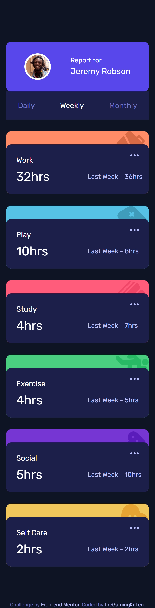

# Frontend Mentor - Time tracking dashboard solution

This is a solution to the [Time tracking dashboard challenge on Frontend Mentor](https://www.frontendmentor.io/challenges/time-tracking-dashboard-UIQ7167Jw). Frontend Mentor challenges help you improve your coding skills by building realistic projects. 

## Table of contents

- [Overview](#overview)
  - [The challenge](#the-challenge)
  - [Screenshots](#screenshots)
  - [Links](#links)
- [My process](#my-process)
  - [Built with](#built-with)
  - [What I learned](#what-i-learned)
  - [Continued development](#continued-development)
  - [Useful resources](#useful-resources)
- [Author](#author)

## Overview

### The challenge

Users should be able to:

- View the optimal layout for the site depending on their device's screen size
- See hover states for all interactive elements on the page
- Switch between viewing Daily, Weekly, and Monthly stats

### Screenshots

### Links

- [Solution](https://github.com/theGamingKitten/time-tracking-dashboard-main)
- [Live](https://time-tracking-dashboard-main-jade.vercel.app/)

## My process

### Built with

- Semantic HTML5 markup
- CSS custom properties
- Flexbox
- CSS Grid
- Mobile-first workflow
- [React](https://reactjs.org/) - JS library

### What I learned

- That I can finish any challenge even if I need a longer break

### Continued development

- Focus more on getting the final product to look as close to the given design as possible. Had to rush this because I just wanted to finish this challenge after a long break and not give up

### Useful resources

- [Guide to CSS Grid](https://css-tricks.com/snippets/css/complete-guide-grid/) - Needed to use this a lot in this challenge as I still struggle with grid layouts

## Author

- Frontend Mentor - [@theGamingKitten](https://www.frontendmentor.io/profile/theGamingKitten)
